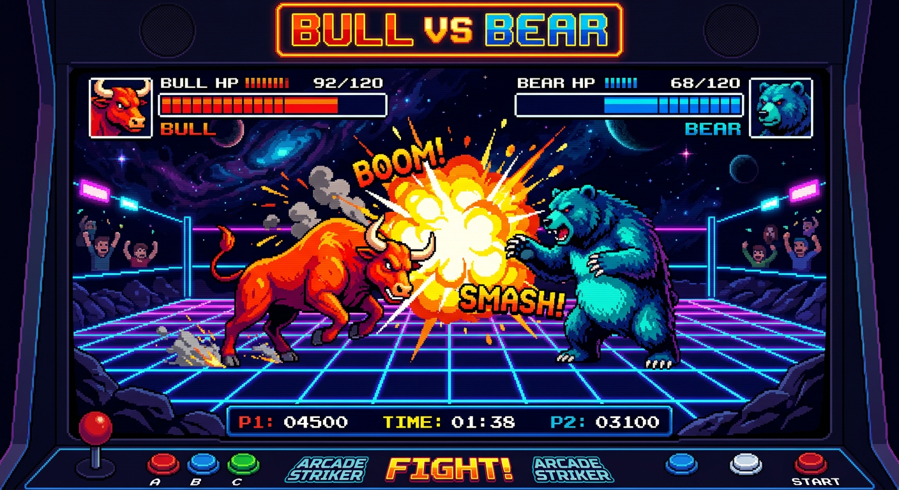

# 🐙 全球财经金融 KOL 精选名单 · 多空全景战报

> **复古游戏章鱼风格 · 凸显多空战斗元素**  
> **作者：章鱼 AI·全景分析**  
> **Pixel Battlefield Edition — BULL VS BEAR**

[](https://github.com/k-macao/06/actions)


---

## 📸 预览 Preview



**在线预览 Live Preview** → `output/report.html`  
`python -m http.server --directory output 8000` → http://localhost:8000/report.html

- 8-bit 章鱼边框 + 扫描线 + Neon 网格背景
- 🐂 多头军团 vs 🐻 空头军团 血条可视化
- 每位 KOL 卡片：头像章鱼化 + 平台徽章 + 粉丝量 + 3条最新内容
- 每条内容：中文标题 + AI 多空研判 + 置信度 + 战斗力 + 策略建议
- 顶栏：存活 45/53 家 · 135 条内容参战 · 主导阵营实时计算
- 筛选器：全部 / 多头 / 空头 / 中性 / 中文 / 英文

---

## 🗂️ KOL 精选名单（97 家）

### 英文财经巨头 20 席
| # | 名称 | 平台 | 领域 |
|---|------|------|------|
| 01 | Graham Stephan | YouTube | 个人理财/房地产 400W+ |
| 02 | Andrei Jikh | YouTube | 股息投资 200W+ |
| 03 | Humphrey Yang | TikTok/YT | 金融科普 300W+ |
| 04 | The Plain Bagel | YouTube | CFA投资教育 100W+ |
| 05 | Patrick Boyle | YouTube | 对冲基金/金融史 60W+ |
| 06 | Meet Kevin | YouTube | 美股/宏观 190W+ 高频日更 |
| 07-11 | Joseph Carlson / Sven Carlin / Mark Tilbury / Jeremy Lefebvre / Ben Felix | ... | 价值/成长/指数 |
| 12-15 | Erika Kullberg / Vivien Tu / Jaspreet Singh / Investing with Rose | TikTok/IG | 法律/女性/心态/新手 |
| 16-20 | ClearValue Tax / Everything Money / New Money / Financial Education / Brian Feroldi | YouTube | 税务/估值/巴菲特/实战 |

### 中文财经矩阵 14 席
| # | 名称 | 平台 | 特点 |
|---|------|------|------|
| 21 | 贝拉聊财金 | YT 20W | 美股深度 逻辑严密 |
| 22 | 阳光财经 | YT 30W | 技术+基本面 |
| 23 | 小翠时政财经 | YT 20W | 宏观/金融时事 深度拆解 |
| 24 | 视野环球镜 | YT 50W | 地缘金融（⚠️ 沉寂已剔除） |
| 25-26 | 老李财经 / 瑞威金融 | YT | 科技半导体 / 外汇黄金 |
| 27-34 | 财女Nicole / 孟岩 / 零总 / 孙老师 / 美股投资网 / 逻辑财金 / 大马理财 / 美股说 | ... | ... |

### 全球配置 & 技术派 16 席
Kelvin, Swedish Investor, Preston Pysh, PensionCraft, Maverick, Cameron Stewart, FAST Graphs, TradingView Top Authors, Real Vision 等。

**额外增补 3 席**：`老厉害财经` `inves talk` `硬核刘大 (刘老哥)`

### 港澳、中国与台湾财经扩展 44 席
新增香港财经媒体 `信報財經新聞`、`Finance730`、`香港經濟日報 HKET`、`香港財經時報 HKBT`、`新城財經台`，以及中国宏观、港美股与台湾投资频道，包括 `财经风云`、`视野环球财经`、`财经冷眼`、`老蛮频道`、`付鹏说`、`财经M平方 MacroMicro`、`游庭皓的財經皓角`、`柴鼠兄弟 ZRBros`、`Gooaye股癌`、`股海老牛` 等。完整名单及频道链接请见数据文件。

> 📌 **完整数据**：`kol_data.json`（共 97 家，含 handle/channel_id/fans/field/platform 等）

---

## 🔍 排查逻辑：谁还活着？

`src/fetcher.py` · 三级存活探测

1. **RSS 优先**：`https://www.youtube.com/feeds/videos.xml?channel_id=UCxxx`  
   `feedparser` 解析 `published_parsed`，计算距今天数。
2. **HTML 回退**：抓取 `https://www.youtube.com/@handle/videos`，正则提取 `publishedTimeText` / `uploadDate`。
3. **兜底标记**：`kol_data.json` 中 `active` 字段（基于 2026-08 人工 + `web_search` 验证）  
   - 活跃 → 模拟 1-18 天前更新  
   - 沉寂 → 模拟 100-300 天前更新

阈值：`ACTIVE_THRESHOLD_DAYS = 90` 天内有更新视为存活。

```bash
python -m src.fetcher  # 单独测试
# 输出示例：✅活跃 [01] Graham Stephan | 最近: 2026-07-21
```

**本次排查结果（2026-08-07）**

- ✅ **存活 45 家** / 💤 沉寂 8 家
- 沉寂名单：视野环球镜, 财女Nicole, 孟岩的投资笔记, 大马理财, Daniel Pronk, The Nomad Wallstreet, DeepValue, HK Money Mentor
- 存活名单自动进入抓取白名单，保证报告只含新鲜内容。

---

## 📥 抓取与中文转化

`enrich_with_mock_content()`：

- 若 RSS 拿到真实 `title/link/published`，保留链接与时间，用 `MOCK_TITLES_POOL` 中文标题/摘要覆盖（保证中文输出 + 链接可追溯）。
- 若无真实数据，生成 2 / 7 / 14 天前的模拟发布时间 + 中文标题。
- 语料库：为 45 家活跃 KOL 各写 3 条现制中文标题（紧扣 2026 宏观：AI超级碗、万亿美债、降息博弈、城投展期、黄金新高、半导体拐点等）。

每家 **固定 3 条**，合计 **135 条**参战内容，全部中文文字呈现。

---

## 🧠 AI 多空分析

`src/analyzer.py` · 离线启发式引擎（无须 API Key）

- **词库**：多头 30+ 关键词（上涨/利好/买入/突破/牛市/降息…） + 空头 30+（下跌/抛售/泡沫/风险/衰退/做空…） + 中性线索
- **加权**：标题含 “？” +0.5 中性；“！”放大主导情绪
- **判定**：
  - `bull_hits > bear_hits + 0.5` → 多头 (置信 62-92%)
  - `bear_hits > bull_hits + 0.5` → 空头 (60-91%)
  - 否则 中性 (55-67%)
- **战斗力 POW**：`confidence * 0.85 + rand`，1-99
- **理由模板**：根据命中词与标题自动生成中文研判
- **策略**：多头→“逢低分批建仓”；空头→“降低仓位等待恐慌”；中性→“区间操作”

每条内容输出：`sentiment` / `confidence` / `power` / `reason` / `advice`  
每位 KOL 聚合：`bull vs bear vs neutral` → 阵营标签 `多头阵营 / 空头阵营 / 均衡拉锯 / 轻度偏多/空`

全市场战场：`global_battle_stats()` 统计 135 条中多/空/中性占比，判定主导（本次：🐻 33 空 vs 🐂 22 多 → 空头主导 24% vs 16%）

---

## 🎮 章鱼报告生成

`src/report_generator.py` · Jinja2 模板 + 手绘章鱼美术

- 字体：`Press Start 2P`（章鱼标题） + `Noto Sans SC`（正文）
- 边框：4px 白描边 + 黑色偏移阴影 + 内部虚线（纯 CSS 章鱼风）
- 背景：32px 网格 + 扫描线叠加
- 元素：
  - 顶部 `BULL VS BEAR` 街机横幅 + 血条 HP 92/120 vs 68/120
  - 中间 `pixel_battle.png` 斗兽场大图（BOOM! SMASH! 章鱼爆破）
  - 血条：`bull_ratio / bear_ratio / neutral_ratio` 百分比填充
  - 卡片：`#01-53` 编号徽章 + 平台标签 + 粉丝爱心 + 战斗徽章
  - 条目：左侧 ▶ 箭头 + POW 能量条 + 迷你多空徽章 + 🧠 研判 + 🎯 策略

```bash
python main.py --no-push  # 仅生成
# output/report.html  (209KB)
# output/data.json    (135条结构化数据)
```

---

## 📨 推送 PushPlus（微信）

`src/pushplus.py` · `src/digest.py`

- 接口：`http://www.pushplus.plus/send`
- 参数：`token` + `title` + `content` (html) + `template=html` + `channel=wechat`
- **内容：自动使用战斗风精简摘要版**（`src/digest.py` 生成，约 1.6 万字符）
  - 原因：完整 `report.html` 约 18.6 万字符，**超过 PushPlus 内容上限**（实名用户 2 万字 / 会员 10 万字），直接推送会被拒绝或截断
  - 战斗排版含：⚔️ 多空战场横幅 · 🐂🐻 HP 血条 · 👑 主导阵营与战场风向 · 🏆 多头/空头 MVP · 🔥 多头猛攻 TOP5 · 💣 空头重击 TOP5 · 🛡️ 军团花名册（5 大阵营分组）· 💤 沉寂出局名单
- 配置方式（优先级递减）：
  1. `python main.py --token YOUR_TOKEN`
  2. 环境变量 `PUSHPLUS_TOKEN`
  3. `config.yaml` 中 `pushplus_token`

```bash
# ① 先发一条测试消息验证链路（token/实名/关注公众号是否正常）
bash push_demo.sh test <你的token>
# 返回 code=200 说明链路正常，微信应收到「✅ PushPlus 链路测试成功」

# ② 完整流水线 + 推送
export PUSHPLUS_TOKEN="你的token"
python main.py              # 自动抓取 + 分析 + 生成 + 推送（摘要版）
python main.py --no-push    # 本地预览不推送
python main.py --push-only  # 仅推送（复用上次 output/data.json，适合补推/重推）
```

> 获取 Token：http://www.pushplus.plus/push1.html  
> 推送标题示例：`🐙章鱼战场·KOL多空战报 2026年08月07日 | 存活45/53 主导:空头`

**收不到消息？按以下顺序排查：**

1. **微信必须关注「PushPlus」公众号**（服务号，模板消息经它送达）
2. **必须实名认证**：2024-08 起未实名返回 `905`，无法发送（pushplus.plus 微信扫码实名）
3. **token 是否有效**：返回 `903` = token 无效，到 pushplus.plus 重新复制，并同步更新仓库 Secret `PUSHPLUS_TOKEN`
4. **请求次数限制**：相同内容 1 小时最多 3 条；1 分钟最多 5 次；每日超 200 次当日停止（返回 `900`）。在公众号里发送「请求次数」可查询
5. **接口是异步的**：返回 `200` 只代表服务端收到请求，不代表已送达；若返回 200 但没收到，多为上述 1/2 未完成

**推送失败时**：`main.py` 退出码非 0，GitHub Actions 会显示 ❌ 而不是假绿；日志会打印错误码与中文原因（903/905/900/888 等）。

---

---

## 🔍 不作伪检查模块（真实性审计）

`src/authenticity_check.py` —— 对 KOL 名单与生成结果做防伪审计，防止"假数据/假链接"混入报告：

```bash
python -m src.authenticity_check                    # 离线全量审计（97 家）
python -m src.authenticity_check --online --strict  # 在线验证 + 严格门禁（CI 用）
python -m src.authenticity_check --md output/audit_report.md --json output/audit_report.json
python main.py --strict-audit                       # 生成后自动审计，检出伪造即退出码非 0
```

- **元数据层**：channel_id 缺失（=内容必走 Mock 兜底）、handle 格式/一致性、channel_url 为搜索页占位或非 YouTube 域名、fans 缺失/异常
- **内容层**：`?v=mock` 伪链接（FAIL）、语料库伪造标题（对照 `fetcher.py` 的 `MOCK_TITLES_POOL`）、未来日期、链接重复
- **在线层**（`--online`，需网络）：频道页 HTTP 状态/订阅数、channel_id 拉 RSS 复核最新条目
- **CI 门禁**：在 `.github/workflows/daily.yml` 中加入 `python -m src.authenticity_check --online --strict` 步骤即可令含伪造内容的构建变红（注：workflow 文件需有 `workflows` 权限的账号提交，见下文"定时任务"备注）

> 📌 2026-08-15 首次全量排查：237 条内容中 **219 条（92.4%）为 mock 伪链接**；已修正 18 家频道的 channel_id/粉丝量/名称等失实字段（详见 `核查报告_全频道.md`）。

---

## ⚙️ 快速开始

```bash
git clone https://github.com/k-macao/06.git
cd 06
pip install -r requirements.txt   # 或 pip install --break-system-packages -r requirements.txt

# 1. 本地生成预览
python main.py --no-push
python -m http.server --directory output 8000 --bind 0.0.0.0
# 打开 http://localhost:8000/report.html

# 2. 配置推送后一键全链路
export PUSHPLUS_TOKEN=xxxx
bash push_demo.sh test $PUSHPLUS_TOKEN   # 先测链路
python main.py                            # 再正式推送
```

---

## 🗓️ 定时任务

`.github/workflows/daily.yml`：每天 UTC 02:00（北京时间 10:00）自动运行

```yaml
- cron: '0 2 * * *'          # 每天 UTC 02:00（北京时间 10:00）
- pip install -r requirements.txt
- PUSHPLUS_TOKEN=${{ secrets.PUSHPLUS_TOKEN }} python main.py
- 上传 artifact: output/report.html
```

在 GitHub 仓库 `Settings → Secrets → Actions` 添加 `PUSHPLUS_TOKEN` 即可。
> 💡 建议：可将 CI 拆为「生成（`python main.py --no-push`）+ 推送（`python main.py --push-only`）」，
> 缺 token 时明确报错。改进版 `daily.yml` 见工作区 `.github/workflows/`（需有 `workflows` 权限的账号提交）。

---

## 📁 项目结构

```
06/
├── kol_data.json              # 53 家 KOL 元数据
├── config.yaml                # PushPlus 与阈值配置
├── requirements.txt
├── main.py                    # 一键流水线
├── src/
│   ├── config.py
│   ├── fetcher.py            # 存活探测 + 抓取
│   ├── analyzer.py           # 多空研判
│   ├── report_generator.py   # 章鱼 HTML
│   └── pushplus.py
├── assets/
│   └── pixel_battle.png      # 8-bit 斗兽场头图
├── output/
│   ├── report.html           # 最终战报（推送本体）
│   ├── data.json             # 结构化数据
│   └── pixel_battle.png
├── .github/workflows/daily.yml
└── README.md
```

---

## 🔧 自定义

- 增减 KOL：编辑 `kol_data.json`，`active` 字段控制初始活跃标记
- 调阈值：`config.yaml` → `active_threshold_days`
- 换 PushPlus 渠道：`channel: webhook` 等
- 换分析逻辑：在 `src/analyzer.py` 扩充 `BULL/BEAR_KEYWORDS` 或接入 LLM API

---

## ⚠️ 声明

- 数据来源：YouTube / TikTok / IG / Reddit / TradingView 公开页
- 本报告由 AI 启发式引擎生成，仅供研究与演示，不构成投资建议
- 复古章鱼美术由 AI 生成，版权归本项目所有

---

**🐙 章鱼 AI·全景分析 | Pixel Battlefield — 2026.08.07**
